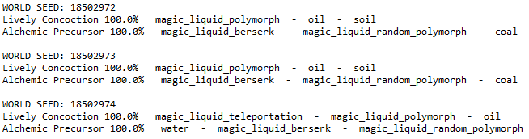

# Why I need this code?
When you are an advanced player in Noita, you will notice that there is alchemy in the game. You can mix specific ingredients to create two mixtures:
* **Lively Concoction** - a healing potion
* **Alchemic Precursor** - a blue potion. Throwing a corpse into it will transform this fluid into "King Midas" potion that transforms everything into gold.


## Features
This is a simple code to finding recipes for this mixtures. You can:
- find recipes existing in a given world seed
- find world seed where exist potion with given 3 materials
- find the same thing as in previous point, but method is more advanced and allows you to set a array with materials, flags specifying which materials you want to find and did you want to find both recipes with this materials or just one.


## Example
```
findSeedBetween(0, 4294967295.0, mat, true, true, true, 100);
```
In this example we set:
- range (0, 4294967295), 
- array of materials, 
- that we want a Lively Concoction,
- that we want a Alchemic Precursor,
- that the return world seed must contain both recipes with our materials that there must by 100% of probability (I don't know what smaller probabilities do but I prefer to find 100% recipes)

When we run the above code, we will see:



## Launch
To run this project, simply run it in your IDE. There is no GUI in the current version.


## Special thanks:
[Zatherz](http://zatherz.github.io/noita/)
